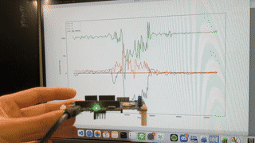

# STM32 WiFi Sensor Streaming Lab

The STM32 IoT node reads the LSM6DSL accelerometer and streams the data over WiFi (TCP) to a Mac, where a Python script plots it in real time. The LSM6DSL significant motion detection is also enabled and reported to the host through a GPIO EXTI interrupt. Completes the **Basic Problem** and **Option Problem 1**.

### Behavior

**Basic Problem: sensor streaming**

1. The board connects to the WiFi access point and opens a TCP connection to the host (port `8002`).
2. When the host sends `s`, the board starts streaming accelerometer data every ~50 ms.
3. Each sample is one line in CSV format:

| Field | Description |
|---|---|
| `x, y, z` | Acceleration in mg (`BSP_ACCELERO_AccGetXYZ`, ±2 g, 52 Hz ODR) |
| `tick` | `HAL_GetTick()` in ms, used as the time axis |

```
-745, -57, 860, 12345
```

Streaming stops when the TCP connection is closed or a send fails.

**Option Problem 1: significant motion detection**

When the LSM6DSL detects a significant motion (8 steps), it raises the INT1 pin. The board catches it through the PD11 EXTI interrupt and sends one extra line to the host:

```
EVENT
```

The host plots the event as a red pulse on the same time axis as the acceleration data.

### Hardware and Environment

| Item | Value |
|---|---|
| Board | B-L475E-IOT01A (STM32L475VGTx) |
| Sensor | LSM6DSL, I2C |
| WiFi module | Inventek ISM43362 (es-WiFi), SPI3 |
| LSM6DSL INT1 | PD11 (EXTI11, `EXTI15_10_IRQn`) |
| LED2 | Error indicator |
| IDE | STM32CubeIDE |
| Base example | `STM32CubeL4/Projects/B-L475E-IOT01A/Applications/WiFi/WiFi_Client_Server` |
| Host | macOS, Python 3 (matplotlib, pandas) |

### Source Code

| File | Description |
|---|---|
| `Src/main.c` | Firmware: WiFi connection, sensor streaming, significant motion setup, EXTI handling |
| `Inc/main.h` | Adds `#include "stm32l475e_iot01_accelero.h"` |
| `Inc/stm32l4xx_hal_conf.h` | Enables `HAL_QSPI_MODULE_ENABLED` |
| `STM32CubeIDE/.project`, `.cproject` | Linked BSP files and include paths |
| `record.py` | Host: receives data from stdin and plots it in real time |

The ST driver files (BSP, LSM6DSL driver) are used unmodified. All custom register access is in `main.c`.

### Significant Motion Setup

Register configuration follows AN5040 Section 6.2, done in `Custom_SIG_MOTION_Init()` after `BSP_ACCELERO_Init()`:

| Step | Register | Value | Purpose |
|---|---|---|---|
| 1 | `FUNC_CFG_ACCESS` | `0x80` | Enable access to embedded functions bank A |
| 2 | `SM_THS` (bank A, `0x13`) | `0x08` | Threshold = 8 steps |
| 3 | `FUNC_CFG_ACCESS` | `0x00` | Back to the normal register bank |
| 4 | `CTRL10_C` | `0x05` | `FUNC_EN` + `SIGN_MOTION_EN` |
| 5 | `TAP_CFG` | `LIR = 1` (read-modify-write) | Latched interrupt mode |
| 6 | `FUNC_SRC1` | read | Clear any latched state left from a previous run |
| 7 | `INT1_CTRL` | `0x40` | Route significant motion to INT1 |

`CTRL1_XL` is not rewritten: the BSP already sets ODR to 52 Hz, which meets the ≥ 26 Hz requirement.

### Interrupt Flow

```
LSM6DSL INT1 ↑ → PD11 (EXTI11, rising edge) → EXTI15_10_IRQHandler
  → HAL_GPIO_EXTI_IRQHandler(GPIO_PIN_11) → HAL_GPIO_EXTI_Callback → Flag = 1
```

1. The ISR only sets a `volatile` flag, keeping it short. No I2C or WiFi access inside the ISR.
2. The streaming loop checks the flag every iteration. When set, it clears the flag, reads `FUNC_SRC1` (which releases the latched INT1), and sends `EVENT`.
3. Latched mode is used because the main loop may be blocked in `WIFI_SendData` for a while. In pulsed mode, the status bit only stays set for ~38 ms and could be missed.

### Host Visualization

`record.py` reads lines from stdin:

1. A reader thread parses each line. Data lines go into `deque(maxlen=200)` buffers; an `EVENT` line marks the next sample as an event. Malformed lines are skipped.
2. The main thread runs a matplotlib `FuncAnimation` (50 ms) that plots X, Y, Z and the event pulse. A lock protects the shared buffers.
3. On exit, the latest samples are saved to `record_data.csv`.

### Setup and Run

1. Fill in `SSID`, `PASSWORD`, and `RemoteIP` (the host IP, e.g. `ipconfig getifaddr en0`) in `Src/main.c`. The WiFi must be 2.4 GHz.
2. Project settings (already included in `.cproject` / `.project`):
   - Include paths: `Drivers/BSP/Components/Common`, `Drivers/BSP/Components/lsm6dsl`
   - Linked files: `stm32l475e_iot01_accelero.c/.h`, `Components/lsm6dsl`
   - MCU Settings: *Use float with printf from newlib-nano*
3. Build and flash the board, then on the host:

```bash
nc -l 8002 | python3 record.py
```

4. Press RESET on the board. After the connection opens, type `s` in the terminal to start streaming. Walk with the board to trigger a significant motion event.


### Demo


